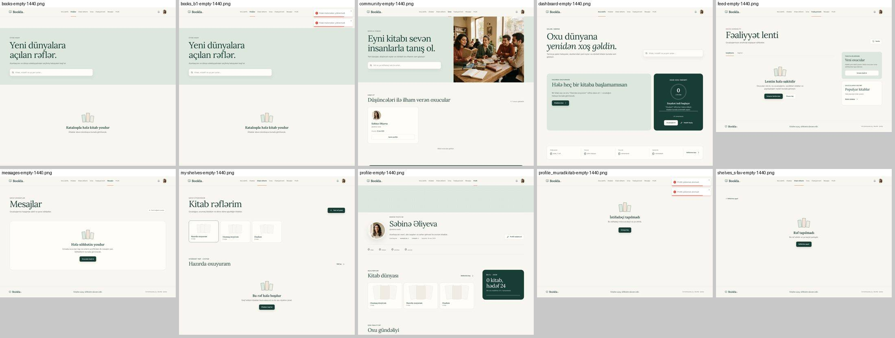
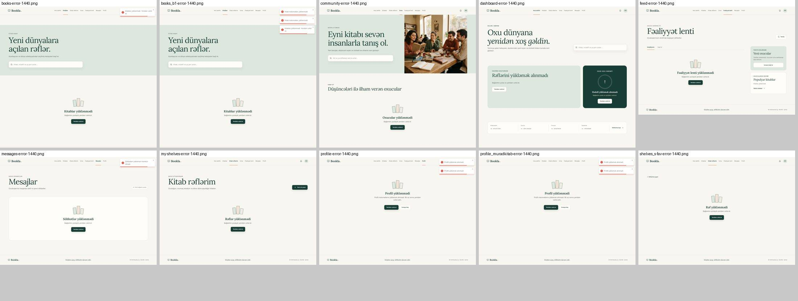
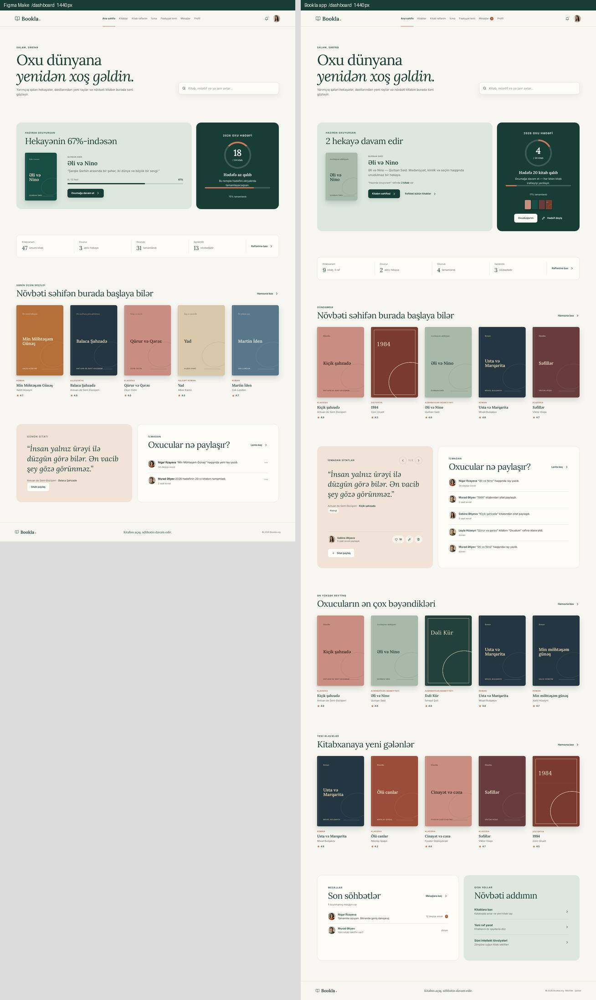
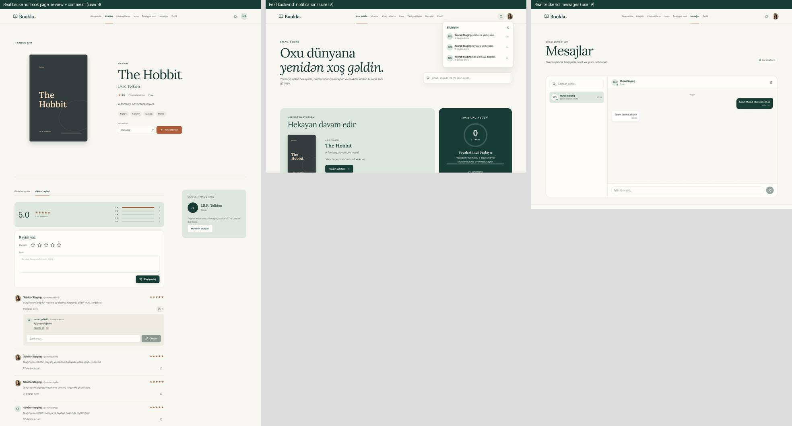
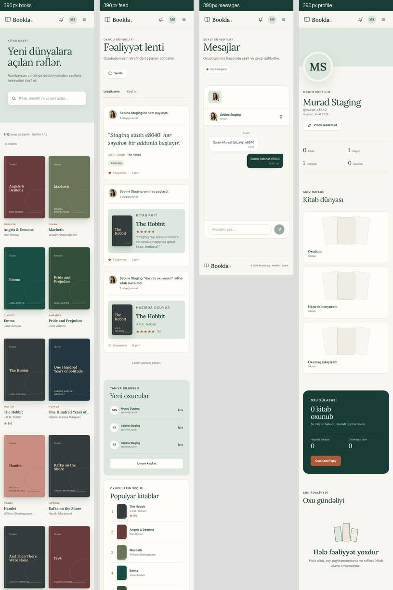

# Bookla 2.0 application — Figma Make verification screenshots

Evidence for the Bookla 2.0 application redesign pull request (Figma Make project
"Bookla 2.0 — Application", file `GNyr0Pv280nkNyrsQYBoDj`). This folder can be deleted after review.

## How these were made

- **Left (Figma Make):** the Make project's own React source, downloaded through the Figma MCP
  server and run locally, captured full page with Playwright/Chromium at DPR 1. It shows Make's sample data.
- **Right (this PR):** the real frontend (`vite` dev server) signed in with a test token. Every
  `/api/*` request is answered by a mock that returns the backend's response shapes
  (`ApiResponse<T>`, `PagedResult<T>`, the DTO field names). The ASP.NET backend and database
  were not run. Names, books and numbers on the right are mock records loaded through the real
  API code paths, not Make's sample data.
- Covers without an uploaded image fall back to Open Library, as before. Open Library is not
  reachable from the test environment, so those books show the typographic cover from the design.
- Widths 1440, 768 and 390. Images are scaled down (1440 at 45 %, 768 at 60 %, 390 at 80 %).

## Images

| Route | Desktop | Tablet | Mobile |
|---|---|---|---|
| `/dashboard` | [1440](dashboard-1440.jpg) | [768](dashboard-768.jpg) | [390](dashboard-390.jpg) |
| `/books` | [1440](books-1440.jpg) | [768](books-768.jpg) | [390](books-390.jpg) |
| `/books/:id` | [1440](books_b1-1440.jpg) | [768](books_b1-768.jpg) | [390](books_b1-390.jpg) |
| `/my-shelves` | [1440](my-shelves-1440.jpg) | [768](my-shelves-768.jpg) | [390](my-shelves-390.jpg) |
| `/shelves/:id` | [1440](shelves_id-1440.jpg) | [768](shelves_id-768.jpg) | [390](shelves_id-390.jpg) |
| `/profile` | [1440](profile-1440.jpg) | [768](profile-768.jpg) | [390](profile-390.jpg) |
| `/profile/:identifier` | [1440](profile_muradkitab-1440.jpg) | [768](profile_muradkitab-768.jpg) | [390](profile_muradkitab-390.jpg) |
| `/community` | [1440](community-1440.jpg) | [768](community-768.jpg) | [390](community-390.jpg) |
| `/feed` | [1440](feed-1440.jpg) | [768](feed-768.jpg) | [390](feed-390.jpg) |
| `/messages` | [1440](messages-1440.jpg) | [768](messages-768.jpg) | [390](messages-390.jpg) |

Make has no separate shelf page: `/shelves/:id` is compared with Make's custom-shelf view at 1440;
the 768 and 390 images show the app only.

Empty and error states of all ten routes (1440):

## Integration test against the real backend

The ten screens were also run end to end against the **real ASP.NET backend** (this repository's
`Backend/`, unchanged) in an isolated local staging environment. Nothing touched production.

- **Stack:** the backend was built with the .NET 8 SDK and started with `RunMigrations=true`, so the
  real EF migrations and seeders ran (34 books). It used a fresh SQL Server database in a local
  `mcr.microsoft.com/azure-sql-edge` container, a local SMTP sink (`EmailSettings:UseSmtp4Dev`) and a
  throwaway JWT secret. The frontend was a production build (`VITE_API_URL=http://localhost:7050`)
  served on `localhost:5175`. OpenAI had a placeholder key, because the API refuses to start without
  one, so AI recommendations were not tested.
- **Method:** Playwright drove two fresh users in two browser sessions through the real UI.
  - Every API response with status 400 or higher, every failed request, and every console or page
    error was recorded.
  - Covered: registration, verification email, login, the reading challenge, catalogue paging and
    search, book facts, reading status, shelves (create, add, rename, remove a book, delete), and
    reviews (create, edit).
  - Also covered: review comments, quotes, follow, feed likes and comments (edit, delete), and
    notifications (live push, open, mark all read, delete).
  - Also covered: profile edit and photo, password change (wrong and correct), other users'
    shelves (read-only), live two-way messages (edit, delete), logout, and all routes at 390 px.
- **Result:** 50/50 steps passed. The only 4xx response was the deliberate wrong-password check.
  Before the fixes, the run found these real problems, now fixed in this PR:
  1. The book page offered a review like button, but `/reviews/get-all-reviews` never reports likes
     (always 0 and not liked), so a second click removed the stored like. The button is gone from
     the book page. Review likes stay on the feed, whose endpoint reports them. The comment count
     appears once the comments are loaded.
  2. After reading or deleting notifications, the next live notification could leave the bell empty
     until a reload. The bell's count is now kept in sync.
  3. Opening a book from a scrolled catalogue landed mid-page under the sticky header. New pages now
     open at the top.
  4. Password errors read a response shape the API never sends, so a wrong current password showed a
     generic failure. It now says "Cari şifrə yanlışdır", and the API's rules are checked first.
  5. `/profile/<id>` links (from notifications and comments) logged a 404 before falling back. Ids
     are now looked up by id first.
- **Backend behaviour noted, not changed** (the backend is out of scope):
  - Review likes create no notification (`ReviewLike` exists but is never emitted). Feed likes on
    quotes create none either.
  - Unread notifications of the same kind and target are merged for 5 minutes.
  - Registration sends no email; users request it from `/verify-email`.
  - The API does not start without an OpenAI key.

## Where the app differs from Make, and why

Make's sample content is not reproduced. Anything Make shows that the API has no data for is left
out or replaced by the real equivalent, and features that exist in the app but not in Make are kept
and styled with the same design system.

| Screen | Difference | Reason |
|---|---|---|
| All | Typographic cover tones are darker (`ochre`, `blue`, `moss`) and the genre label is fully opaque | Make's labels fail WCAG AA contrast (3.35–4.12 : 1) |
| All | Focus ring: 2px dark terracotta outline; 24px gap between empty-state text and its button | Visible keyboard focus; Make's empty-state button touches its text |
| Dashboard | "N hekayə davam edir" instead of "Hekayənin 67%-indəsən"; no chapter or progress bar | No reading-progress data |
| Dashboard | Challenge panel has covers and two actions; no pace forecast | Real challenge data and the existing set/view actions |
| Dashboard | Three book rows (trending, top rated, new) and a conversations/shortcuts row | Existing dashboard features kept; rows are not personalised, so the eyebrow is not "SƏNİN ÜÇÜN SEÇİLDİ" |
| Dashboard | Quote card pages through community quotes and has like/edit/delete | Existing quote features |
| Books | No genre chips | The catalogue never filtered by genre |
| Book page | No "1,284 oxucu…" line, no related-books row, author not a link | No such data, no related-books API, no author page |
| Book page | Review form, rating distribution, likes and comments | Existing review features plus the existing like/comment API |
| My shelves | No "Hamısı" card; empty shelves show outlined slots | Only the user's real shelves exist |
| Profile | "oxunub" instead of "rəy"; reading-year card instead of month bars; full feed cards | Real numbers only; no monthly data |
| Profile | Edit dialog has no username field but has bio, location, birth date and social links | No API to change the username; existing fields kept |
| Community | Reader cards show joined date, no book/follower counts | The user list has no counts |
| Community | Large "Oxuduğunu paylaş…" heading | Make's own CSS shrinks it to 12px (`.community-note span` hits the heading lines) |
| Feed | "Yenilə" button and a "Populyar kitablar" side card | Existing feed features |
| Messages | Times, read receipts, unread counts, connection chip, delete-conversation button | Existing messaging features |
| All | No "prototip üçündür" demo notes | They describe Make, not the app |
