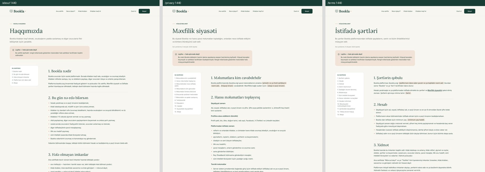
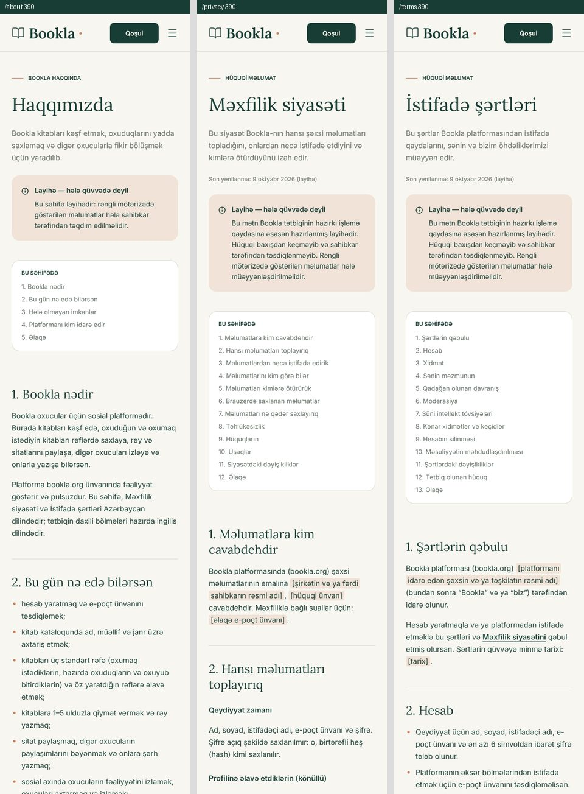

# Landing page — Figma verification screenshots

Evidence for the Bookla landing page pull request (Figma file `8UDMyfuP2zWZIYfEjfRWYR`,
frames "Bookla — Masaüstü" 1440, "Planşet" 768 and "Mobil" 390). All captures come from
the production build (`vite build` + `vite preview`) using Playwright/Chromium at DPR 1.
This folder can be deleted after review.

| Frame | Page height (impl / Figma) | Max text offset (vertical / horizontal) | Pixels differing vs Figma |
|---|---|---|---|
| Desktop 1440 | 6187 / 6187 | 0.00 / 1.66 px | 0.76 % |
| Tablet 768 | 8790 / 8790 | 0.00 / 1.66 px | 0.98 % |
| Mobile 390 | 11264 / 11264 | 0.00 / 1.44 px | 1.29 % |

The pixel figures include the deliberate changes below. Layout, sizes and text positions are
unchanged; only the listed labels, colours and the dotted capital İ differ.

## Deliberate differences from Figma

**Honest buttons and feature status.** The app has no clubs, polls or meetings, so nothing
offers them, and each advertised feature shows its real state. "Tezliklə" (coming soon) is used
only for reading progress, the one advertised feature already in development (it has an API but
no screen). Features with no code at all say "Mövcud deyil" (not available) until the owner
confirms they are planned.

| Element | Figma | This PR | Why |
|---|---|---|---|
| Header button → `/register` | Klub yarat | Qoşul | Registration creates an account, not a club |
| Hero button → `/register` | Pulsuz klub yarat | Pulsuz qoşul | Same |
| Sample club cards (×3) | Kluba bax ↗ (link) | Klublar mövcud deyil (status) | Sample clubs can't be opened |
| Steps 01 / 02 / 03 | — | Mövcud deyil / Mövcud deyil / Qismən | Clubs and polls don't exist; reviews and comments do |
| Kitab rəfi | — | Mövcuddur | `/my-shelves` |
| Oxu irəliləyişi | — | Tezliklə | Backend and API exist, no screen yet |
| Birgə səsvermə, Klub görüşləri | — | Mövcud deyil | No code |
| Qeydlər və sitatlar | — | Qismən | Quotes exist; personal notes don't |
| Kitab müzakirələri | — | Qismən | Book reviews and comments exist; club discussions don't |

**Azerbaijani casing.** The page is `lang="az"`, so the uppercase eyebrows render "YENİ",
"SOSİAL" (Figma shows English casing, "YENI"). Glyph widths are unchanged.

**WCAG AA contrast.** 18 small texts in the Figma palette were below 4.5:1. They now use two
added tokens, checked on every background they sit on:

| Token | Used for | Ratio on its backgrounds |
|---|---|---|
| `bookla-muted-strong` `#5f6860` (was `#69736a`) | feature descriptions, sample-clubs note, poll "5 səs", hero "Azərbaycan ədəbiyyatı", "OXU QEYDİ" | 4.55 sage · 4.88 sand · 4.60 blush |
| `bookla-clay-strong` `#ad5a38` (was `#c97959`) | club genre labels, hero "Nümunə", photo caption "Bookla" | 4.89 white · 4.52 paper |

Every other text keeps its Figma colour and already passes (the lowest is 4.56:1 for muted on
paper; the 31 px step numbers are large text at 3.05:1, threshold 3:1). The only text that does not
reach 4.5:1 is the book-title lettering on the miniature cover illustrations inside the decorative
(`aria-hidden`) previews, where it crosses the cover art. WCAG 1.4.3 exempts text that is part of
a picture.

## Information pages

`/about`, `/privacy` and `/terms`, built with the landing page's header, footer, tokens and type
scale. They are drafts: a notice at the top says so, facts only the owner can supply are
highlighted in brackets, and the pages carry `noindex` until approved.

## Figma vs implementation

Left: Figma · middle: implementation · right: pixelmatch diff (red = differs, yellow = anti-aliasing).

### Desktop 1440

### Hero at 1:1 (top: Figma, bottom: implementation)

### Tablet 768

### Mobile 390

## Small screens (below the 390 px frame)

The first review round's build compared with the current build, at 360 px and 320 px.

## Interaction states

Hover, keyboard focus and the mobile menu. Figma defines no interaction states, so the
resting appearance matches the design and only hover/focus differ.

## Before / after (previous landing page vs this PR)

### 1440

### 1024

### 768

### 390

