# Landing page — Figma verification screenshots

Evidence for the Bookla landing page pull request (Figma file `8UDMyfuP2zWZIYfEjfRWYR`,
frames "Bookla — Masaüstü" 1440, "Planşet" 768 and "Mobil" 390). All captures come from
the production build (`vite build` + `vite preview`) using Playwright/Chromium at DPR 1.
This folder can be deleted after review.

| Frame | Page height (impl / Figma) | Max text offset (vertical / horizontal) | Pixels differing vs Figma |
|---|---|---|---|
| Desktop 1440 | 6187 / 6187 | 0.00 / 1.66 px | 0.75 % |
| Tablet 768 | 8790 / 8790 | 0.00 / 1.66 px | 0.96 % |
| Mobile 390 | 11264 / 11264 | 0.00 / 1.44 px | 1.26 % |

The pixel figures include the deliberate changes below. Compared with the previously verified
build, only those labels changed (about 11,400 px per frame); every other pixel is identical.

## Deliberate differences from Figma

The app has no clubs, polls or meetings yet, so the buttons that promised them now name what they
do, and each advertised feature shows whether it is available. Layout, sizes and positions are
unchanged; only these labels differ.

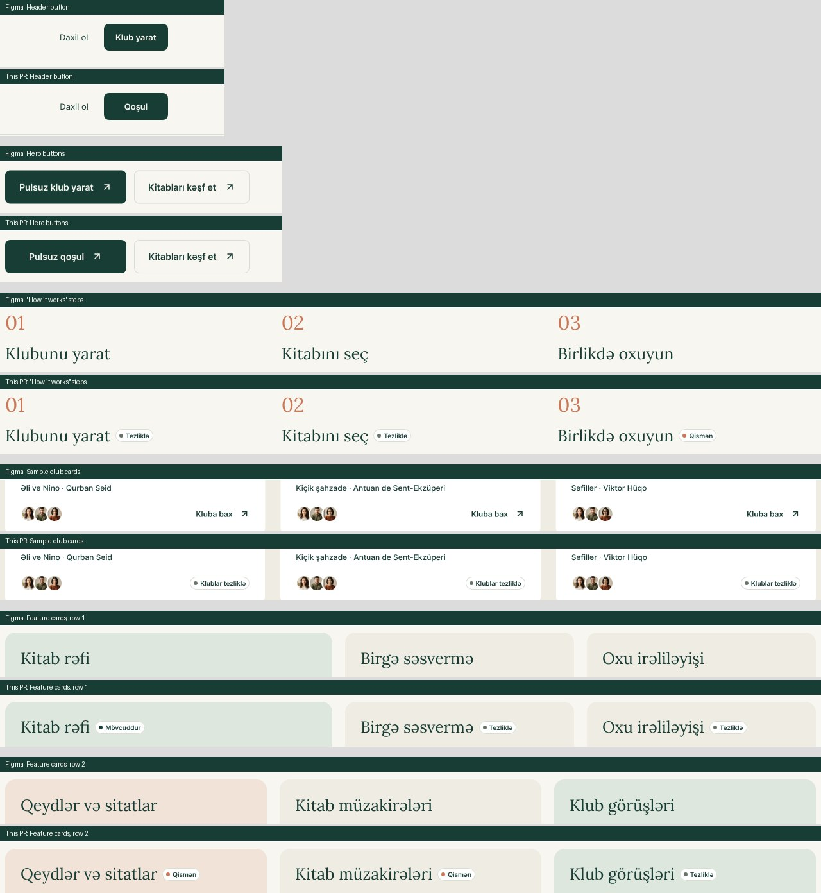

| Element | Figma | This PR | Why |
|---|---|---|---|
| Header button → `/register` | Klub yarat | Qoşul | Registration creates an account, not a club |
| Hero button → `/register` | Pulsuz klub yarat | Pulsuz qoşul | Same |
| Sample club cards (×3) | Kluba bax ↗ (link) | Klublar tezliklə (status, no link) | Sample clubs can't be opened |
| Steps 01 / 02 / 03 | — | Tezliklə / Tezliklə / Qismən | Clubs and polls are missing; reviews and comments exist |
| Kitab rəfi | — | Mövcuddur | `/my-shelves` |
| Birgə səsvermə, Oxu irəliləyişi, Klub görüşləri | — | Tezliklə | No UI in the app |
| Qeydlər və sitatlar | — | Qismən | Quotes exist; personal notes don't |
| Kitab müzakirələri | — | Qismən | Book reviews and comments exist; club discussions don't |

## Figma vs implementation

Left: Figma · middle: implementation · right: pixelmatch diff (red = differs, yellow = anti-aliasing).

### Desktop 1440
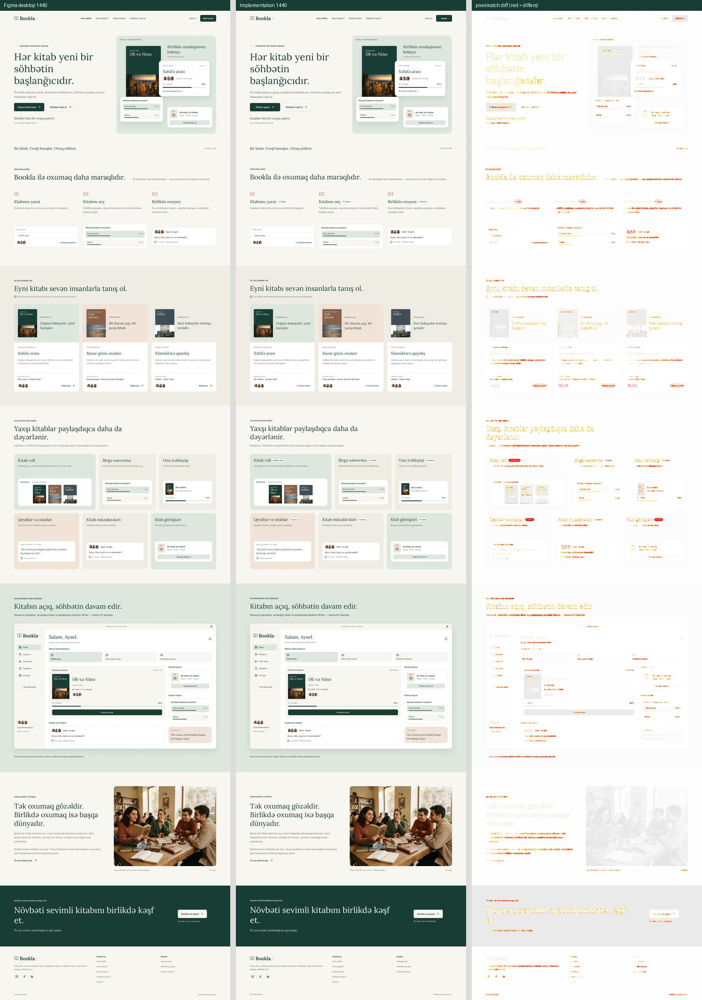

### Hero at 1:1 (top: Figma, bottom: implementation)
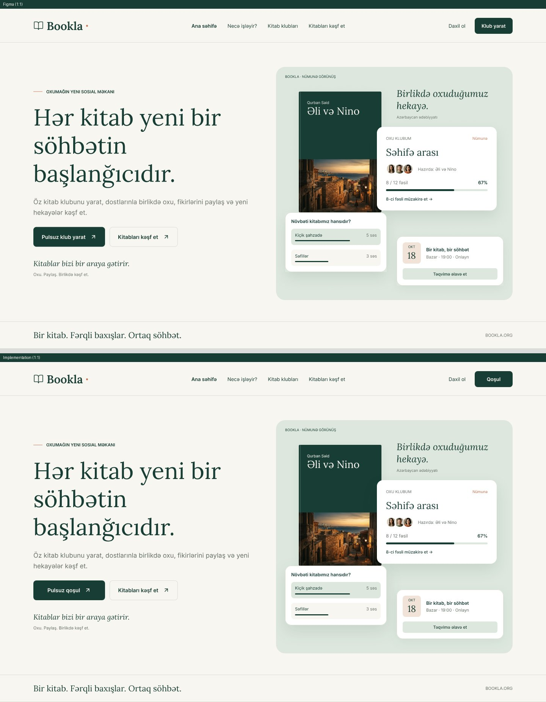

### Tablet 768
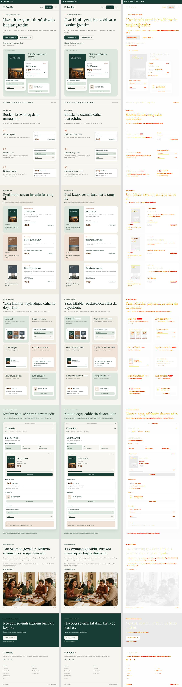

### Mobile 390
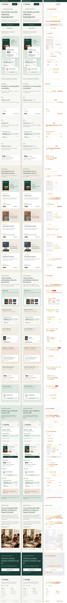

## Small screens (below the 390 px frame)

The first review round's build compared with the current build, at 360 px and 320 px.

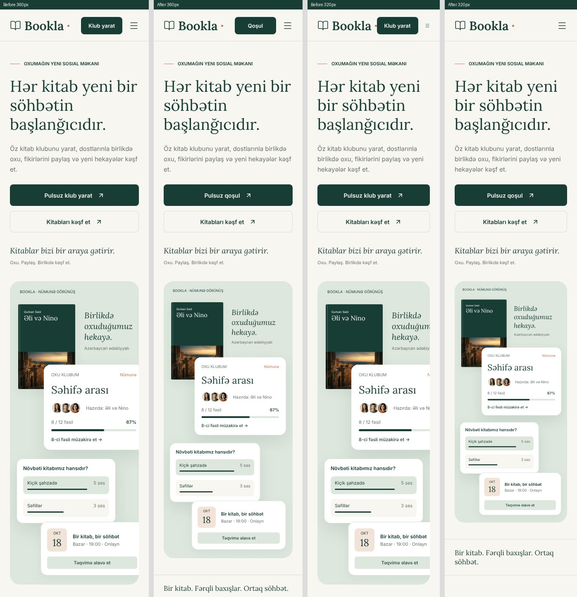

## Interaction states

Hover, keyboard focus and the mobile menu. Figma defines no interaction states, so the
resting appearance matches the design and only hover/focus differ.

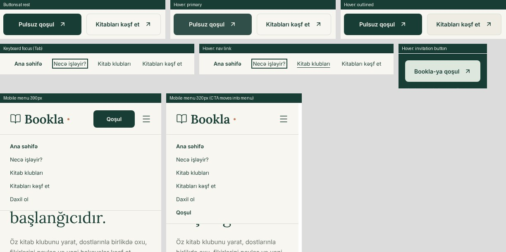

## Before / after (previous landing page vs this PR)

### 1440
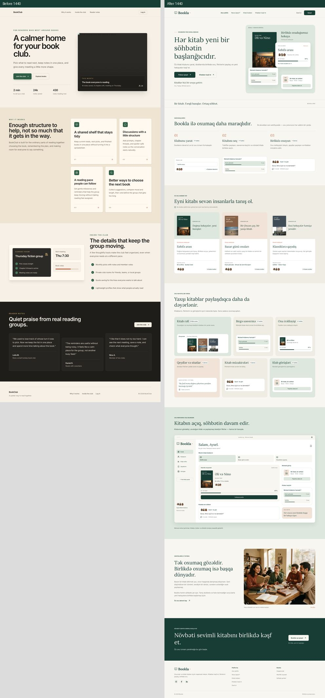

### 1024
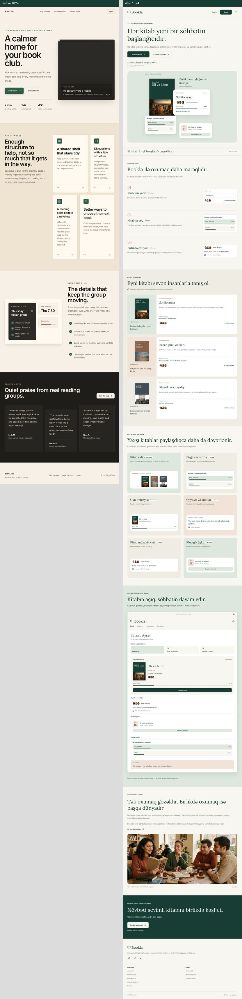

### 768
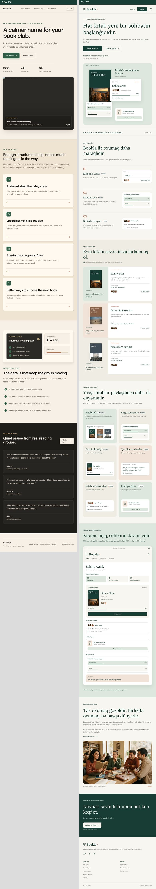

### 390
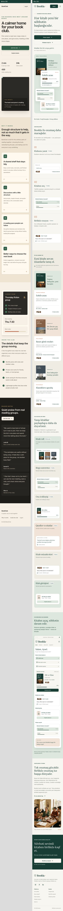
